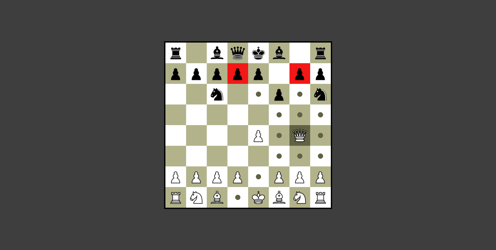
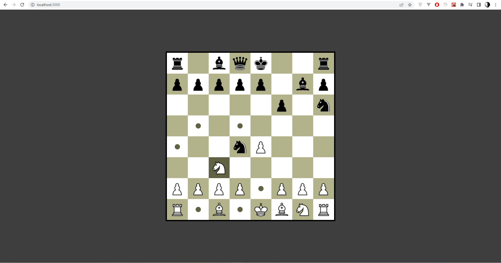

# Simple Chess Application Based on TypeScript + React + OOP

## Preview

### Scripts
To run application:
### `npm install`
will install the all dependencies 
### `npm start`

Open [http://localhost:3000](http://localhost:3000) to view it in the browser.

### `npm run build`

Builds the app for production to the `build` folder.\
It correctly bundles React in production mode and optimizes the build for the best performance.

